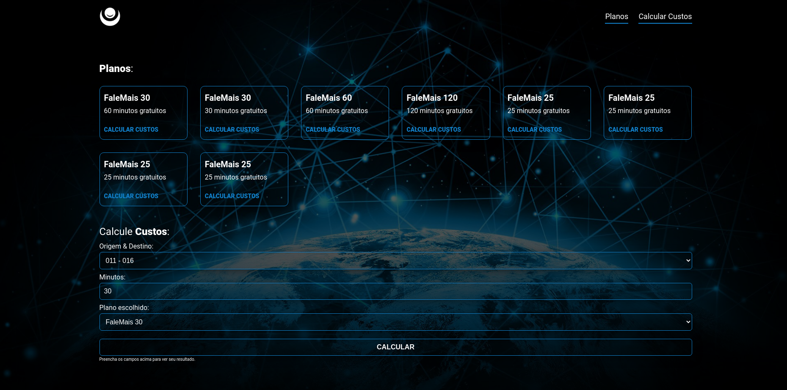
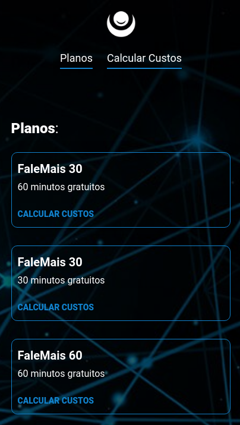
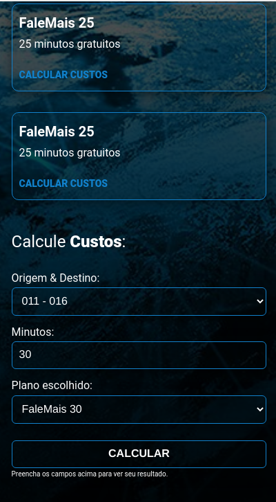

<div style="display: flex; align-items: center; justify-content: center">
  
  <h1>LOLDESIGN!</h1>
</div>





Esse projeto tem:

- Nx Workspace
  - NextJS
    - react-query
      - graphql-request
    - real-time update
    - 7x1 sass pattern
    - BEM naming
  - Nest.js
    - GraphQL
      - Apollo Server
  - Shared Interfaces
  - Custom and infinites plans
  - Custom and infinites origins and destinies

Comando pra rodar tudo:

```shell
docker-compose up -d && npm install && npm run start:server
```

depois de rodar o comando acima, o backend vai estar pronto, agora a hora do frontend

Em outro terminal, digite:

```shell
npm run start:frontend
```

Como acabou o prazo do projeto, acabei nao criando testes e as seeds no banco de dados para nao ser injusto com outros participantes.

Se quiser testar mesmo assim, siga as seguintes queries, que podem ser inseridas no graphql playground `/graphql`
<br>  
<br>

Criar um plano:

```graphql
mutation Plan {
  createPlan(createPlanInput: { name: "FaleMais 30", free_minutes: 30 }) {
    free_minutes
    id
    name
  }
}
```

Criar origem, destino e preço por minuto

```graphql
mutation CallCost {
  createCallCost(
    createCallCostInput: {
      origin: "013"
      destiny: "017"
      price_per_minute: 1.70
    }
  ) {
    price_per_minute
    id
  }
}
```
